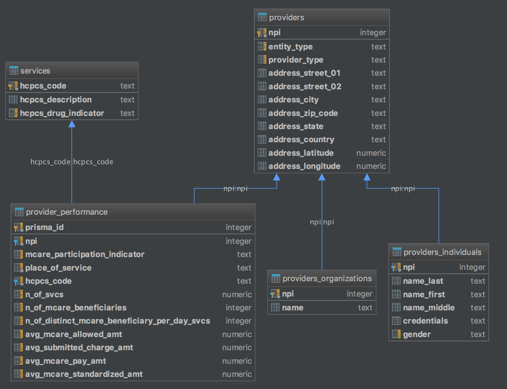
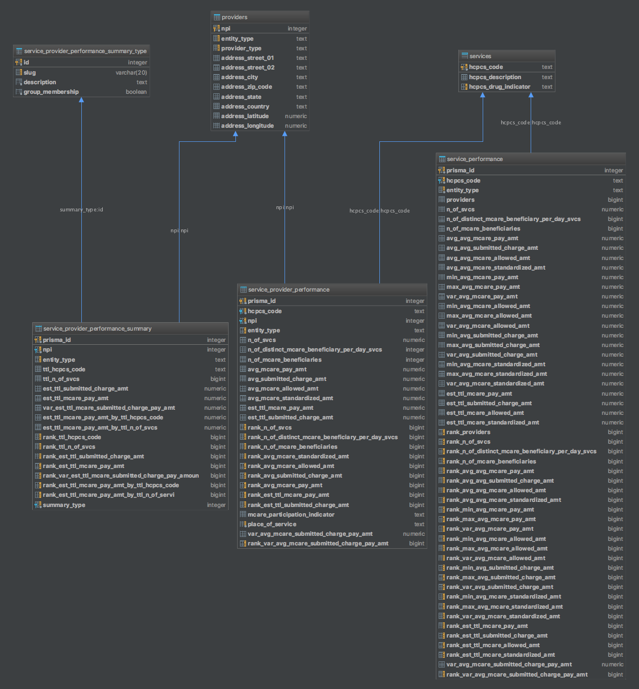

# CMS Utilization & Payment Database

### The purpose of the project is to provide a containerized database service loaded with CMS data in order to increase the utility of the dataset and reduce the technical overhead associated with consuming it.

Stakeholders pursuing healthcare price transparency can use this database to learn about costs & volumes of HCPCS services, provider performance (as reported in source data and additional derived analytic data), and understand finer details related to healthcare costs.

Examples of detailed healthcare costs:
- variance between charges & payments
- variance in payments between providers for the same service
- average costs nationally for individual healthcare services

Examples of derived analytic data:
- Ranking of Providers by Total Services Provided
- Ranking of Providers by HCPCS Services Provided
- Estimated Sum Amount `charged` & `received` by Provider
- Estimated Sum Amount `charged` & `received` by Provider & HCPCS Service
- Estimated Sum Amount `charged` & `received` by HCPCS Service
- Ranking of Providers by Total $ Charged to CMS
- Ranking of Providers by Total $ Paid from CMS

For background knowledge see :
- [`Source Data: CMS Utilization & Payment Data`](https://data.cms.gov/Medicare-Physician-Supplier/Medicare-Provider-Utilization-and-Payment-Data-Phy/utc4-f9xp/data)
- [`NPPES NPI: wikipedia`](https://en.wikipedia.org/wiki/National_Provider_Identifier)
- [`NPPES NPI: api`](https://npiregistry.cms.hhs.gov/)
- [`HCPCS: wikipedia`](https://en.wikipedia.org/wiki/Healthcare_Common_Procedure_Coding_System)
- [`HCPCS: CMS Datasets`](https://www.cms.gov/Medicare/Coding/HCPCSReleaseCodeSets/Alpha-Numeric-HCPCS.html)

---

##  <a id="quick-start"></a>Quick Start

```
make start
```
- postgres database | port 5432
- credentials
	- **database:** govdata
	- **user:** dbuser
	- **password:** dbpassword

This command starts the database and restores the schema (structure & data) from a db.dump that is baked into the docker image.

This initiation process will take 10+ mins (sample `time` report provided below) to complete on the first run. Subsequent starts rely on persistent data.

	:: real	11m5.184s
	:: user	0m15.680s
	:: sys	0m2.800s

---

##  <a id="db-data-source"></a>Source data

The foundation of this project is a `.csv` dataset titled, _Medicare Provider Utilization and Payment Data: Physician and Other Supplier PUF CY2016_.

You can find a full description of the dataset on [`their site`](https://data.cms.gov/Medicare-Physician-Supplier/Medicare-Provider-Utilization-and-Payment-Data-Phy/utc4-f9xp/data), but for convenience, a summarized description is below: 

> The Centers for Medicare & Medicaid Services (CMS) has prepared a public data set that provides information on services and procedures provided to Medicare beneficiaries by physicians and other healthcare professionals.
The dataset contains information on utilization, payment (allowed amount and Medicare payment), and submitted charges organized by National Provider Identifier (NPI), Healthcare Common Procedure Coding System (HCPCS) code, and place of service.
This data represents calendar year 2016 and contains 100% final-action physician/supplier Part B non-institutional line items for the Medicare fee-for-service population.

---

##  <a id="db-schema"></a>Schema

Within the database, the data is organized into 9 tables (5 **source data** tables & 4 **analytic data** tables).

### Source Data Tables



- `services` contains all HCPCS Services represented in the source file.

- `providers` (and related tables `providers_individuals` & `providers_organizations`) contains identity information & address for each provider (distinguished by `providers.entity_type`).

- `provider_performance` contains performance statistics for each HCPCS service provided by each provider.

### Analytic Data Tables



- `service_performance` aggregates performance statistics for each HCPCS service across all providers.

- `service_provider_performance` extends the data contained in `provider_performance`, estimates cumulative amounts charged & paid (`n_of_svcs` * `amt`), and also generates performance rankings by compares each provider's performance attributes against **all other providers** that also perform the service.

- `service_provider_performance_summary` aggregates each provider's performance statistics across all HCPCS services. The summary also estimates cumulative amounts charged & paid (`n_of_svcs` * `amt`) and generates performance rankings by comparing each provider's performance attributes against **all other providers**.

- `service_provider_performance_summary_type` is used to define different ways of generating summaries (provider groupings and/or service subsets) within `service_provider_performance_summary`.
  
	Currently summaries supported:
    - all providers + all services
    - all providers + non-drug HSPCS services
    - all providers + drug HSPCS services
    - [**`future`**](https://github.com/sudowing/cms-utilization-db/issues/1): enterprise providers + all services

---

##  <a id="prisma-requirements"></a>Prisma IDs

The first planned consumer of this DB was a GraphQL service.

[`That project`](https://github.com/sudowing/cms-utilization-graphql) uses [`prisma`](https://github.com/prisma/prisma) to provide a GraphQL API to the data. Unfortunately, when developing that project, I noticed that prisma currently doesn't support composite keys (although the feature is proposed for [`Datamodel v2`](https://github.com/prisma/prisma/issues/3405)).

To resolve this in the meantime, new **auto incrementing** primary keys were defined (as `prisma_id`). The original keys still exist, but are no long the primary key for their respective tables.

---

##  <a id="additional-data-sets"></a>Additional Data Sets

Similar projects can be built using data from these **additional data stores**:
- [`CMS Data Catalog`](https://data.cms.gov/)
- [`Open Payments: Overview`](https://www.cms.gov/openpayments/)
- [`Open Payments: Data`](https://openpaymentsdata.cms.gov/)
- [`Medicare.gov: Data`](https://data.medicare.gov/)
- [`Medicaid & CHIP Open Data`](https://data.medicaid.gov/)
- [`DATA.GOV: Health Data Catalog`](https://catalog.data.gov/dataset?_organization_limit=0&organization=hhs-gov#topic=health_navigation)
- [`HealthData.gov`](https://healthdata.gov/)
- [`Chronic Conditions Data Warehouse`](https://www.ccwdata.org/web/guest/home)

---

##  <a id="project-origin"></a>Project Origin & Inspiration

I've been interested in healthcare utilization & payment data since I read an article by Steven Brill in _Time Magazine_ in 2013.

In the years since, I've seen dozens of smaller, similar reports in various media, but I've yet to see anything as comprehensive and detailed as the original piece.

In appreciation of Brill's work, and to direct interested parties towards information that is probably relevant to their projects, I'm publishing links to some of those resources here.

- [`Original Time Article`](http://time.com/198/bitter-pill-why-medical-bills-are-killing-us/)
  - **Title**: Bitter Pill: Why Medical Bills Are Killing Us
  - **Author**: Steven Brill
  - **Date**: Apr 04, 2013
- [`Minutes from Congressional Hearing`](https://www.govinfo.gov/content/pkg/CHRG-113shrg87496/pdf/CHRG-113shrg87496.pdf)
  - **Event**: Congressional Hearing before the COMMITTEE ON FINANCE
  - **Title**: High Prices, Low Transparency: The Bitter Pill of Health Care Costs
  - **Date**: June 18, 2013
  - **Note**: Specific attention to the opening statement on page 5-6 (pdf page 9-10).
- [`Federal Register Volume 83, Number 192`](https://www.govinfo.gov/content/pkg/FR-2018-10-03/html/2018-21500.htm)
  - **Section X**: Requirements for Hospitals To Make Public a List of Their 
  Standard Charges via the Internet
- [`CMS FAQs about 2019 Pricing Transparency Requirements`](https://www.cms.gov/Medicare/Medicare-Fee-for-Service-Payment/AcuteInpatientPPS/Downloads/FAQs-Req-Hospital-Public-List-Standard-Charges.pdf)

---

##  <a id="development"></a>Development

### Run Service

```
make run
```

This command starts the DB service, and mounts several of the local directories (scripts, sql, tmp) in the container.

### Generate DB Export

```
make db-dump-sql
```

This command connects to the container running the DB service and generates a sql export via `pg_dump`.

**NOTE 1:** This sql.dump file is large (1gb) and as such, is not stored in the repo (`.gitignore`). To generate this file (for inspection or when publishing a new docker image), 
you must generate this file, and have it locally, **before** baking the docker image.

### Restore DB from Export

```
make db-load-via-sql
```

This command connects to the container running the DB service and restores the db using the sql.dump file generated above.

### Build & Load DB via ETL Process

```
make db-load-via-etl
```

This command builds the database through an ETL process that downloads the original `.csv`, loads it into temp tables, then builds prod tables and populates them from the temp tables. 

Anyone interested in validating the integrity of the data provided by the published docker image for project, should focus their attention here.

**NOTE 1:** ETL process takes 2.5+ hours.

**NOTE 2:** ETL process downloads the original CSV from the government’s servers and stores it inside the container at `/tmp/cms-utilization.csv`
If you're running the project in development mode (`make run`), this file should be available to you at `/volumes/tmp/cms-utilization.csv` 


---

##  <a id="versioning"></a>Versioning

We use [SemVer](http://semver.org/) for versioning. For the versions available, see the [tags on this repository](https://github.com/sudowing/cms-utilization-db/tags). 

---

##  <a id="license"></a>License

This project is licensed under the MIT License - see the [LICENSE.md](LICENSE.md) file for details
